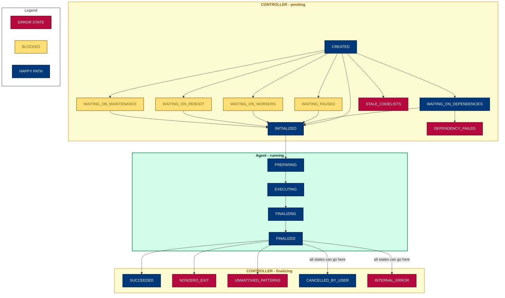

# Developer notes

- [Local development](#local-development)
  - [Pre-requisites](#prerequisites-for-local-development)
  - [Dependency management](#dependency-management)
  - [Getting started](#getting-started)
  - [Running jobs locally](#running-jobs-locally)
  - [Running jobs with a local job-server](#running-locally-with-a-local-job-server)
  - [Testing](#testing)
- [Operating Principles](#operating-principles)
- [Architecture](#architecture)
  - [The RAP Agent](#the-rap-agent)
  - [The RAP Controller](#the-rap-controller)
  - [The RAP Controller APIs](#the-rap-controller-apis)
  - [Configuration](#configuration)
  - [Job State](#job-state)
- [Running jobs on the test backend](#running-jobs-on-the-test-backend)
- [job-runner docker image](#job-runner-docker-image)
- [Database schema and migrations](#database-schema-and-migrations)
- [Deployment](#deploying)
- [Running controller commands in production](running-controller-commands-in-production)
  - [Turn manual database maintenance mode on/off](#turn-manual-database-maintenance-mode-onoff-on-a-specific-backend)
  - [Pause a backend](#pause-a-backend)
  - [Prepare for reboot](#prepare-for-reboot)


## Local development

### Prerequisites for local development

### Just

We use [`just`](https://just.systems/man/en/) as our command runner. It's
a single file binary available for many platforms so should be easy to
[install via package managers](https://just.systems/man/en/packages.html) or
from [pre-built binaries](https://just.systems/man/en/pre-built-binaries.html).

```sh
# macOS
brew install just

# Linux
apt install just

# Add completion for your shell. E.g. for bash:
source <(just --completions bash)

# Show all available commands
just #  shortcut for just --list
```

### uv

Follow installation instructions from the [uv documentation](https://docs.astral.sh/uv/getting-started/installation/) for your OS.


### Python

You'll need an appropriate version of Python on your PATH. Check the
`.python-version` file for the required version.

### Docker

You will also need an up-to-date version of Docker Compose. Instructions to install it are [here](https://docs.docker.com/compose/install/).


## Dependency management
Dependencies are managed with `uv`.

### Overview
See the [uv documentation](https://docs.astral.sh/uv/concepts/projects/dependencies) for details on usage.
Commands for adding, removing or modifying constraints of dependencies will automatically respect the
global timestamp cutoff specified in the `pyproject.toml`:
```toml
[tool.uv]
exclude-newer = "YYYY-MM-DDTHH:MM:SSZ"
```
Changes to dependencies should be made via `uv` commands, or by modifying `pyproject.toml` directly followed by
[locking and syncing](https://docs.astral.sh/uv/concepts/projects/sync/) via `uv` or `just` commands like
`just devenv` or `just upgrade-all`. You should not modify `uv.lock` manually.

Note that `uv.lock` must be reproducible from `pyproject.toml`. Otherwise, `just check` will fail.
If `just check` errors saying that the timestamps must match, you might have modified one file but not the other:
  - If you modified `pyproject.toml`, you must update `uv.lock` via `uv lock` / `just upgrade-all` or similar.
  - If you did not modify `pyproject.toml` but have changes in `uv.lock`, you should revert the changes to `uv.lock`,
  modify `pyproject.toml` as you require, then run `uv lock` to update `uv.lock`.

The timestamp cutoff should usually be set to midnight UTC of a past date.
In general, the date is expected to be between 7 and 14 days ago as a result of automated weekly dependency updates.

If you require a package version that is newer than the cutoff allows, you can either manually bump the global cutoff
date or add a package-specific timestamp cutoff. Both options are described below.

### Manually bumping the cutoff date
The cutoff timestamp can be modified to a more recent date either manually in the `pyproject.toml`
or with `just bump-uv-cutoff <days-ago>`.
For example, to set the cutoff to today's date and upgrade all dependencies, run:
```
just bump-uv-cutoff 0
just upgrade-all
```

### Adding a package-specific timestamp cutoff
It is possible to specify a package-specific timestamp cutoff in addition to the global cutoff.
This should be done in the `pyproject.toml` to ensure reproducible installs;
see the [uv documentation](https://docs.astral.sh/uv/reference/settings/#exclude-newer-package) for details.
If set, the package-specific cutoff will take precedence over the global cutoff regardless of which one is more recent.

You should not set a package-specific cutoff that is older than the global cutoff - use a version
constraint instead.
If there is good reason to set a package-specific cutoff that is more recent than the global cutoff,
**care should be taken to ensure that the package-specific cutoff is manually removed once it is over 7 days old**,
as otherwise future automated updates of that package will be indefinitely blocked.
Currently no automated tooling is in place to enforce removal of stale package-specific cutoffs.

## Getting started

Set up a local development environment with:
```
just devenv
```

This runs `uv sync` and installs the production and dev dependencies.

It also creates a `.env` file from `dotenv-sample`, and populates the minimum
required environment variables.

Note that the `dotenv-sample` file contains environment variables required by both the *agent*
and *controller* components of the system; in production these components are deployed
separately and will only require a subset of the variables set. See comments in the
file for information on which components require each variable.

Before running any of the components, migrate your database with:
```
just migrate
```

This will apply the required schema and prepare the database for use by the
components. If the components are run and attempt to access it before this step
has been done the database may end up in a bad state that can't be recovered
with `just migrate` and need to be removed.

### Optional

#### GitHub PAT

Update `.env` to add a value for `PRIVATE_REPO_ACCESS_TOKEN`; this should be a
developer [GitHub PAT](https://docs.github.com/en/authentication/keeping-your-account-and-data-secure/managing-your-personal-access-tokens#about-personal-access-tokens) with `repo` scope.

This is not required in order to run the project locally, unless you wish to test
running jobs from private GitHub repos, and/or you want to exercise the full test
suite (some tests in `tests/lib/test_git.py` are skipped if this environment variable
is missing).

#### Docker images

Pull docker images used by the agent for some types of task. If these aren't
present when needed the agent will raise an exception which mentions which
image it needs.

```
docker pull ghcr.io/opensafely-core/ehrql:v1
docker pull ghcr.io/opensafely-core/python:latest
docker pull ghcr.io/opensafely-core/r:latest
```

### Running jobs locally

> [!WARNING]
> The `add-job` command should only be used in local development

Adding jobs locally is most easily done with the `just add-job` command, which
calls `jobrunner.cli.controller.add_job` with a study repo, an action to run, and
a backend to run it on e.g.
```
just add-job https://github.com/opensafely/test-age-distribution run_all --backend test
```

As well as URLs this will accept paths to local git repos e.g.
```
git clone git@github.com:opensafely/test-age-distribution.git ../test-age-distribution
just add-job ../test-age-distribution run_all --backend test
```

In order to pick up and execute the job, you need to run the three job-runner
components.

```
just run
```

This will run all 3 components together. If you need to run only a subset, or you want to run
them separately (e.g. to more easily see what each component is logging), you can run them each
in separate terminal windows:

```
# Controller service
just run-controller

# Controller django app
just run-app

# Agent service
just run-agent
```

You should see the controller pick up the new job and create a RUNJOB task for it.
Then you'll see the agent poll for new tasks every second or so (in the In the controller app terminal,
if you're running the services separately).
Then the agent will receive the new task, execute the job, and call the controller app
to update the controller after each step.

See the full set of options `add-job` will accept with:
```
just add_job --help
```
Outputs and logs from the job can be found at `workdir/high_privacy` and `workdir/medium_privacy`.
Note that `add-job` adds a job with a workspace named `test` by default, so e.g. high privacy
outputs will be found in `workdir/high_privacy/workspaces/test`.

### Running locally with a local job-server

To run a more complete system locally, you can connect your local agent and controller components to
a locally running job-server.

#### Setup and run job-server locally
Setup a local job-server as described in the [job-server docs](https://github.com/opensafely-core/job-server/blob/main/DEVELOPERS.md#local-development).

If using a [fresh install](https://github.com/opensafely-core/job-server/blob/main/DEVELOPERS.md#setting-up-a-fresh-install) ensure that you have a backend called "test" (others can be set up and
configured later). Run the local server and go to http://localhost:8000/staff/backends to find the
token for this backend - we'll need it shortly. Also make sure you have at least one project/workspace
set up.

Make sure that your `.env` file has a valid PAT (a classic PAT with repo scope) for the `JOBSERVER_GITHUB_TOKEN`.

#### Configure job-runner settings

Ensure that the following variables are set in your `.env` file:

```
# These must be obtained from your local job-server and must be the same
# CONTROLLER_TASK_API_TOKEN is used by the Agent to authenticate with the Controller API
# We currently reuse job-server's backend tokens for this
# TEST_JOB_SERVER_TOKEN is used by the Controller when communicating with job-server
CONTROLLER_TASK_API_TOKEN=<token obtained from local job-server for the test backend>
TEST_JOB_SERVER_TOKEN=<token obtained from local job-server for the test backend>
# This is a comma-separated list of tokens that can access the backend called "test" using
# The RAP API; it should correspond to `RAP_API_TOKEN` in your local job-server.
TEST_CLIENT_TOKENS=<tokens>

# These are all set by default in dotenv-sample
BACKENDS=test
BACKEND=test
CONTROLLER_TASK_API_ENDPOINT=http://localhost:3000/
```

#### Run all the things

In 2 terminal windows, run:

In job-server repo:
1) Run the server and the rap_status_service (to fetch job updates): `just run-all`

In job-runner repo:
2) Run web app, agent and controller: `just run`


In your terminals you should see:
1) job-server:
     - web server starts up
     - rap status service logs calls to rap/status every 60s (or as frequently as configured by
       `RAP_API_POLL_INTERVAL` in `job-server/.env`)
2) controller:
    - /test/tasks/ is called every 2 seconds (by the agent)
    - /controller/v1/rap/status/ is called by job-server every 60s
    - Agent and Controller start up


#### Submit a job
Go to your local job-server at http://localhost:8000 and submit a job for the workspace
you set up earlier.  In your terminals you should see the job request be submitted on
job-server, picked up by the controller service and jobs created, executed on the agent,
and updated via the controller web app.


#### Simulating multiple backends

Running multiple backends requires running multiple agents, one per backend.

Once you're set up and running with a local job-server as described above, you're running a
controller, a web app, and an agent **for the test backend only**.

To add another backend, "expectations":
1) Setup the backend on your local job-server
2) in .env, add the following Controller variables:
   - Add EXPECTATIONS_JOB_SERVER_TOKEN with the backend token from job-server (allows the expectations agent to call the controller webapp)
   - Add EXPECTATIONS_CLIENT_TOKENS=rap_token (allow job-server to call the controller for information about the expectations backend)
   And the following Common variable
   - set BACKENDS=test,expectations

*Note*:
We're using "expectations" as a second backend to take advantage of the fact that [ehrql currently ignores
backends named "test" or "expectations"](https://github.com/opensafely-core/ehrql/blob/d250d7ff6668b2322256b82a958b6606ba37530d/ehrql/__main__.py#L775). We could also set up a backend that
is a valid backend according to ehrql (i.e. "tpp" or "emis"); any other backend identifier will fail to
run ehrql jobs.

The controller will now check for jobs for both backends ("expectations" and "test"). Locally we can
only pretend to be one backend's Agent, so only "test" jobs will be picked up and executed by the
agent.

To execute "expectations" jobs, in your `.env` file change the following Agent variables:
 - `BACKEND=expectations`
 - set `CONTROLLER_TASK_API_TOKEN` to the backend token from job-server for the expectations backend (allows the agent to call the controller webapp)
 . Remember to restart all the things to pick up the
new environment variables everywhere.

Alternatively, to run 2 agents at the same time, one for the test backend and one for the expectations backend:

Clone repo again to new dir and set up initial dev environments:
```
git clone git@github.com:opensafely-core/job-runner.git job-runner-expectations-agent
cd job-runner-expectations-agent
just devenv
```

Update .env file with:
```
BACKENDS=test,expectations
BACKEND=expectations
CONTROLLER_TASK_API_TOKEN=<backend token from job-server for the expectations backend>
```
(Note that we don't need to update any controller config, as we'll only be running the agent from this repo)

With your original local job-runner and job-server running (with `just run`), run just the agent for this backend:

```
just run-agent
```

In your job-runner terminal, you should see that both agents are now calling the controller tasks endpoint every 2 seconds, at:
/test/tasks/
/expectations/tasks/

From your job-server UI, you should now be able to submit jobs for both the test and expectations backends.


### Testing


Tests can be run with:

    just test

Some of these tests involve talking to GitHub and there is a big fat
integration test which takes a while to run. You can run just the fast
tests with:

    just test-fast

The big integration test takes several seconds to run.
If you want to know what it's up to you can get pytest to show the log output with:

    just test-verbose

#### Testing in docker

To run tests in docker, simply run:

    just docker/test

This will build the docker image and run tests.

You can run a command inside the docker image with:

    just docker/run ARGS=command  # bash by default


There is also a functional test that runs in docker. This runs the controller and agent
in separate docker containers, and adds and runs a job.

    just docker/functional-test


## Operating principles

The project creates jobs to be run based on requests made by [OpenSAFELY job-server](https://github.com/opensafely-core/job-server) via the [RAP API](#rap-api).

Jobs belong to a `workspace`. This describes the git repo containing the
OpenSAFELY-compliant project under execution and the git branch.
The workspace also acts as a kind of namespace for partitioning outputs of its jobs.
Jobs can also target a specific database (such as in the case of TPP whether to use
the database that includes type-1-opt-outs).

An OpenSAFELY-compliant repo must provide a `project.yaml` file which
describes how a requested job should be converted into a command (& arguments)
that can be run in a subprocess on the secure server.  It incorporates the idea
of dependencies, so an action that generates a chart might depend on an action
that extracts data from the database *for* that chart.  See the
[Actions reference](https://docs.opensafely.org/actions-intro/) for more information.

An action can define `outputs`; these are persisted on disk and made available
to subsequent actions in the workspace, and to users who have permission to log
into the server and view the raw files.

The RAP controller takes care of executing dependencies in order. By default, it skips
re-running a dependency whose previous run produced output that still exists in
the production environment. The RAP controller reports status updates on request from the job-server, redacting possibly-sensitive information.

### Consuming jobs

A job runner's RAP Agent is a service installed on a machine that has access to a given
backend. It retrieves tasks from the RAP Controller and consumes those whose `backend` value matches the
value of the current `BACKEND` environment variable.

It must also define at least one environment variable which is an RFC1838 connection
URL; these correspond to the `database_name` requested in the job's definition,
and as such are named `DEFAULT_DATABASE_URL`, and `INCLUDE_T1OO_DATABASE_URL`.

When a job is found, the following happens:

* The corresponding repo is fetched. Private repos are accessed using
  the `PRIVATE_REPO_ACCESS_TOKEN` supplied in the environment.
* The RAP Controller parses `project.yaml` using [OpenSAFELY Pipeline][pipeline]:
  * Individual `actions` are extracted from this file
  * A dependency graph is calculated for the requested action; for example, an
    action might depend on three previous actions before it can be run
  * Each action in the graph is checked to see if it needs to be run
  * If a dependency has failed, then the requested action fails
  * If the dependency needs to be run, a new task for running the dependent job is pushed to the RAP Controller's queue,
    and the current job is postponed
  * If an action has no dependencies needing to be run, then it is added to the
    RAP Agent's queue of tasks to be run
  * The RAP Agent polls the RAP Controller's queue for tasks to be run &
    runs everything it receives
  * On completion, a status code and message are reported back to the RAP Controller via
    the Controller Task API. Job-server polls the RAP Controller (via the RAP API) for job status updates. If the
    job failed, an error message is reported, and a user with requisite permissions can log into the
    production environment and examine the job logs in [Airlock](https://docs.opensafely.org/outputs/viewing-with-airlock/#log-files) for the full error.

[pipeline]: https://github.com/opensafely-core/pipeline

### Output locations

Every action defines a list of `outputs` which are persisted to a permanent
storage location.  The project author must categorise these outputs as either
`highly_sensitive` or `moderately_sensitive`.  Any pseudonymised data which may
be highly disclosive (e.g. without low number redaction) should be classed as
`highly_sensitive`; data which the author believes could be released following
review should be classed as `moderately_sensitive`. Study authors and collaborators with requisite
permissions can log into the secure environment and view `moderately_sensitive` outputs via
[Airlock](https://docs.opensafely.org/outputs/viewing-with-airlock/).

Outputs are persisted to filesystem paths according to the following
environment variables:

```sh
# A location where patient-level (one row per patient) output files should be
# stored. This folder must exist.
HIGH_PRIVACY_STORAGE_BASE=/srv/high_security

# A location where aggregated outputs (some for publication) should be
# stored
MEDIUM_PRIVACY_STORAGE_BASE=/srv/medium_privacy
```

### Project.yaml

The `project.yaml` format is described in the [OpenSAFELY Action Pipelines documentation](https://docs.opensafely.org/actions-pipelines/#projectyaml-format).

## Architecture

The project consists of two main components which are intended to run entirely separately:
- the **RAP [agent](agent/)**: executes tasks
- the **RAP [controller](controller/)**:  schedules tasks

The RAP agent communicates with the RAP controller via an [http API (a Django app)](controller.webapp/), using the [Controller Task API](#controller-task-api)

A *task* is an activity that the controller schedules and the agent executes.
Tasks can (currently) take 3 forms:
- `RUNJOB`: A task to run a specific job.
- `CANCELJOB`: A task to cancel an existing RUNJOB task, and stop the job if
it is already running.
- `DBSTATUS`: A task to check if the backend database is in maintenance mode.

### The RAP Agent

The RAP Agent has two main entrypoints:
- [agent.main]./(agent/main.py) polls the Controller API for
    active tasks. For jobs, it runs docker containers to execute the required actions.
    The bulk of the work here is done by the [local Docker executor](./agent/executors/local.py) implementation module which starts new Docker containers and stores the appropriate job metadata and outputs when they finish. It updates the Controller
    about the progress of tasks by calling the Controller API.
- [agent.metrics](./agent/metrics.py) records and logs docker and
    system stats for running jobs.

Both are  implemented as infinite loop with fixed sleep periods and are designed to be run
together as a [service](./agent/service.py).


### The RAP Controller

The RAP Controller has one entrypoint:

- [controller.main](./controller/main.py) polls its database for
    active jobs and takes appropriate action. This involves creating RUNJOB tasks for
    new jobs, creating CANCELJOB tasks for jobs which have been cancelled, retrieving
    associated tasks for running jobs and updating their status.

Jobs are created via the [RAP API](#rap-api) `create` endpoint and the [create_or_update_jobs](./controller/create_or_update_jobs.py) module does the bulk of the work.

Only the Controller has access to its database of Jobs and Tasks.

### The RAP Controller APIs

This is a very simple [Django application](./controller.webapp/) that allows external
applications and users to communicate with the Controller. Users of the RAP Controller APIs may be Agents inside backends (which consume the [Controller Task API](#controller-task-api)) or external clients like job-server (which consume the [RAP API](#rap-api)).

#### Controller Task API
The Controller Task API has two endpoints, and uses a backend-specific token to authenticate. These endpoints are essentially view wrappers around methods in the
controller's [tasks api module](./controller/task_api.py):

- `/<backend>/tasks/`: returns all active tasks for <backend>
- `/<backend>/task/update/`: receives information about a task and updates the controller database

#### RAP API
The RAP API is used by non-agent clients to communicate with the RAP Controller. It has four endpoints which are defined in the [rap api views](./controller/webapp/views/rap_views.py) module. They are authenticated by the tokens received as part of job-server's request.

- `/backend/status/`: returns information about the status of backends. This endpoint is polled by job-server every minute.
- `/rap/cancel/`: cancels actions within a specific job request.
- `/rap/create/`: creates jobs for a job request.
- `/rap/status/`: returns current status of jobs in the controller database for the requested RAP IDs. This endpoint is polled by job-server every minute.

We use the OpenAPI specification to describe the API. See the [RAP API](./controller/webapp/api_spec/RAP_API_DEVELOPERS.md) documentation for more details.


### Configuration

Configuration is set via environment variables, parsed in the [config](./jobrunner/config)
module. Config is split into:
- common: configuration required by both Agent and Controller (but not necessarily identical in both when deployed in production)
- agent: configuration required by Agent only
- controller: configuration required by Controller only


### Job State

Jobs move through a defined set of `StatusCode`s as the Controller manages them and the
Agent prepares and executes them.

These are defined in `controller/models.py`.

The diagram below shows the transitions, but all states have an implicit transition to
`INTERNAL_ERROR` or `CANCELLED_BY_USER`, which is not shown. Jobs can also
transition from running states back to `WAITING_ON_REBOOT` or `WAITING_DB_MAINTENANCE`. Once the system is ready again, these jobs will be picked up and restarted.




Additional state diagrams including notes on the state of docker containers and volumes during the various state transitions can be found at [docs/](docs/):
- [Combined execution state diagram](docs/execution_state_diagram.md)
- [Controller state diagram](docs/controller_state_diagram.md)
- [Agent state diagram](docs/agent_state_diagram.md)

There are also

## Running jobs on the test backend

The [test backend](https://github.com/opensafely-core/backend-server/tree/main/backends/test) is
a test version of an OpenSAFELY backend which has no access to patient data, but can be used to
schedule and run jobs in a production-like environment.


### Using job-server

If you have an account on <jobs.opensafely.org> with relevant permissions, you can select "Test" as the backend when running jobs. This will exercise the entire user interaction, using
the test backend instead of a production backend, and results of the jobs will be reported back to job-server.

### Viewing logs in the server

To view logs for running jobs, refer to [the playbook](https://github.com/opensafely-core/backend-server/blob/main/playbook.md).

You’ll need SSH access to <test.opensafely.org> to inspect job logs. This access currently requires the same permissions as any non-test backend; see the
[developer permissions documentation](https://bennett.wiki/products/developer-permissions-log/#platform-developerstesters) for further details.


## job-runner docker image

Building the docker image:

    just docker/build                   # build base and dev image
    just docker/build prod              # build base and prod image


## Database schema and migrations

jobrunner uses a minimal ORM-lite wrapper to talk to the DB.

The current version of a tables schema definition is stored in the the
`__tableschema__` attribute for that model's class, i.e. `Job.__tableschema__`.
This is use to create the table in dev and test, so migrations are not usually
needed in those cases.

### Adding a migration

However, we also occasionally need to apply changes to this schema in
production, or in a user's local opensafely-cli database.

To do this, we track migrations in `controller/models.py`. Add a migration like so:

```python
database.migration(1, """
DDL STATEMENT 1;
DDL STATEMENT 2;
""")
```

These statements are run together in a single transaction, along with
incrementing the `user_version` in the database.

Note: be aware that there are various restrictions on ALTER TABLE statements in
sqlite:

https://www.sqlite.org/lang_altertable.html#alter_table_add_column


### Applying migrations


Trying to run jobrunner as a service will error if the database does not exist
or is out of date, as a protection against misconfiguration.

To initialise or migrate the database, you can use the migrate command:

```sh
just migrate
```

## Deploying

Deployment is handled automatically on merge to main. See the [DEPLOY](./DEPLOY.md)
documentation for more details.


## Running controller commands in production

Certain actions can be run in production via controller manage commands.

In dokku4:

```
dokku run rap-controller python manage.py <command>
```

### Turn manual database maintenance mode on/off on a specific backend

Maintenance mode is triggered automatically, but in some circumstances we may need to
manually enable or disable it. Enabling db maintenance mode will cancel any running jobs.

```
dokku run rap-controller python manage.py db_maintenance <on/off> <backend slug>

# i.e. to turn maintenance mode on for the tpp backend
dokku run rap-controller python manage.py db_maintenance on tpp
```

### Pause a backend

Pausing a backend prevents the controller from scheduling new run-job tasks. Existing scheduled
tasks and running jobs will not be interrupted.

```
dokku run rap-controller python manage.py pause <on/off> <backend slug>

# i.e. to pause the test backend
dokku run rap-controller python manage.py pause on test
```

### Prepare for reboot

Prepare for a backend reboot. This will cancel all running jobs and reset them to PENDING so they will be
automatically re-run after a reboot.

First [pause the backend](#pause-a-backend).

Then run:
```
dokku run rap-controller python manage.py prepare_for_reboot --backend <backend slug>
```

This will list all running jobs for the backend and ask for confirmation before cancelling them.

To report on the status of jobs:

```
dokku run rap-controller python manage.py prepare_for_reboot --backend <backend slug> --status
```

Once all jobs have been successfully cancelled, the status report will indicate that it is now
safe to reboot.

```
$dokku4 dokku run rap-controller python manage.py prepare_for_reboot --backend test --status

== PREPARING FOR REBOOT ==
1) backend 'test' is paused
2) 0 job(s) are running

== READY TO REBOOT ==
Safe to reboot now
```
