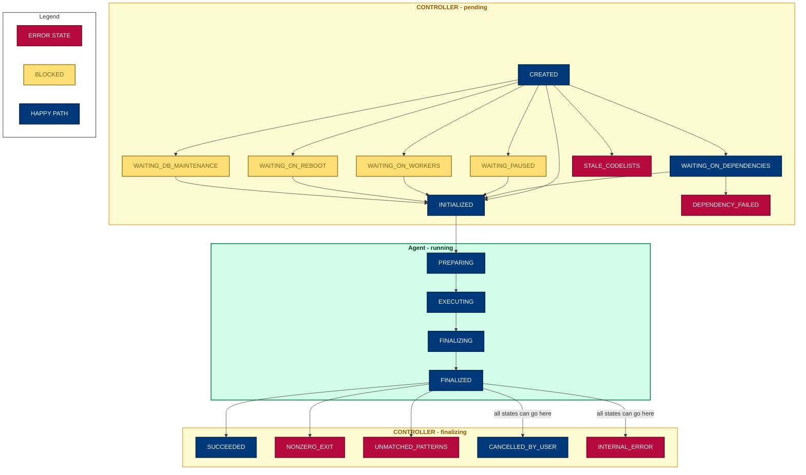

# Developer notes


## Prerequisites for local development

### Just

We use [`just`](https://just.systems/man/en/) as our command runner. It's
a single file binary available for many platforms so should be easy to
[install via package managers](https://just.systems/man/en/packages.html) or
from [pre-built binaries](https://just.systems/man/en/pre-built-binaries.html).

```sh
# macOS
brew install just

# Linux
apt install just

# Add completion for your shell. E.g. for bash:
source <(just --completions bash)

# Show all available commands
just #  shortcut for just --list
```

### Python

You'll need an appropriate version of Python on your PATH. Check the
`.python-version` file for the required version.

### Docker

You will also need an up-to-date version of Docker Compose. Instructions to install it are [here](https://docs.docker.com/compose/install/).


## Getting started

Set up a local development environment with:
```
just devenv
```

This creates a virtual environment and installs the production dependencies in
`requirements.txt` (which are intentionally kept minimal) and the dev dependencies in `requirements.dev.txt`.

It also creates a `.env` file from `dotenv-sample`, and populates the minimum
required environment variables.

Note that the `dotenv-sample` file contains environment variables required by both the *agent*
and *controller* components of the system; in production these components are deployed
separately and will only require a subset of the variables set. See comments in the
file for information on which components require each variable.

### Optional
Update `.env` to add a value for `PRIVATE_REPO_ACCESS_TOKEN`; this should be a
developer [GitHub PAT](https://docs.github.com/en/authentication/keeping-your-account-and-data-secure/managing-your-personal-access-tokens#about-personal-access-tokens) with `repo` scope.

This is not required in order to run the project locally, unless you wish to test
running jobs from private GitHub repos, and/or you want to exercise the full test
suite (some tests in `tests/lib/test_git.py` are skipped if this environment variable
is missing).

## Operating principles

The project retrieves jobs to be run from an [OpenSAFELY job
server](https://github.com/opensafely-core/job-server) by polling the job server.

Jobs belong to a `workspace`. This describes the git repo containing the
OpenSAFELY-compliant project under execution and the git branch.
The workspace also acts as a kind of namespace for partitioning outputs of its jobs.
Jobs can also target a specific database (such as in the case of TPP whether to use
the database that includes type-1-opt-outs).

An OpenSAFELY-compliant repo must provide a `project.yaml` file which
describes how a requested job should be converted into a command (& arguments)
that can be run in a subprocess on the secure server.  It incorporates the idea
of dependencies, so an action that generates a chart might depend on an action
that extracts data from the database *for* that chart.  See the
[Actions reference](https://docs.opensafely.org/actions-intro/) for more information.

An action can define `outputs`; these are persisted on disk and made available
to subsequent actions in the workspace, and to users who have permission to log
into the server and view the raw files.

The runner takes care of executing dependencies in order. By default, it skips
re-running a dependency whose previous run produced output that still exists in
the production environment.  The runner also reports status back to the job
server, redacting possibly-sensitive information.

The runner is bundled as part of the [opensafely-cli][cli] tool so users
can test their actions locally. The bundled version is frozen at v2.75.3 as
later versions of job-runner do not provide `local_run`, see
[this opensafely-cli ticket][cli-ticket] for more information.

[cli]: https://github.com/opensafely-core/opensafely-cli
[cli-ticket]: https://github.com/opensafely-core/opensafely-cli/issues/330

### Job structure

The job server serves jobs as JSON. See the [job-server serializer](https://github.com/opensafely-core/job-server/blob/5f490d55ad1e6fd187d6da37d0907200550052ce/jobserver/api/jobs.py#L227)
and the [job-runner converter](https://github.com/opensafely-core/job-runner/blob/main/jobrunner/sync.py#L127) for more details.

Some important fields include:

```json
{
    ...
    "database_name": "default"
    "workspace": {
        "name": "my workspace",
        "repo": "https://github.com/opensafely/job-integration-tests",
        "branch": "main",
    }
    ...
}
```
Valid values for `"database_name"` can be found in [VALID_DATABASE_NAMES][common-config],
and are currently "default", and "include_t1oo".

[common-config]: https://github.com/opensafely-core/job-runner/blob/main/jobrunner/config/common.py

### Consuming jobs

A job runner's RAP Agent is a service installed on a machine that has access to a given
backend. It retrieves tasks from the RAP Controller and consumes those whose `backend` value matches the
value of the current `BACKEND` environment variable.

It must also define at least one environment variable which is an RFC1838 connection
URL; these correspond to the `database_name` requested in the job's definition,
and as such are named `DEFAULT_DATABASE_URL`, and `INCLUDE_T1OO_DATABASE_URL`.

When a job is found, the following happens:

* The corresponding repo is fetched. Private repos are accessed using
  the `PRIVATE_REPO_ACCESS_TOKEN` supplied in the environment.
* The RAP Controller parses `project.yaml` using [OpenSAFELY Pipeline][pipeline]:
  * Individual `actions` are extracted from this file
  * A dependency graph is calculated for the requested action; for example, an
    action might depend on three previous actions before it can be run
  * Each action in the graph is checked to see if it needs to be run. Actions do
    not need to be run if:
    * they already have output generated from a previous run;
    * they are currently running;
    * they failed for a "fatal" reason on their last run
  * If a dependency has failed, then the requested action fails
  * If the dependency needs to be run, a new task for running the dependent job is pushed to the RAP Controller's queue,
    and the current job is postponed
  * If an action has no dependencies needing to be run, then it is added to the
    RAP Agent's queue of tasks to be run
  * The RAP Agent polls the RAP Controller's queue for tasks to be run &
    runs everything it receives
  * On completion, a status code and message are reported back to the RAP Controller via
    the RAP Controller API. The RAP Controller will then report back to the job-server.
    On completion, non-sensitive information about the outcome of the job is posted back to job-server. If the
    job failed, an error message is reported, and a user with requisite permissions can log into the
    production environment and examine the job logs in [Airlock](https://docs.opensafely.org/outputs/viewing-with-airlock/#log-files) for the full error.

[pipeline]: https://github.com/opensafely-core/pipeline

### Output locations

Every action defines a list of `outputs` which are persisted to a permanent
storage location.  The project author must categorise these outputs as either
`highly_sensitive` or `moderately_sensitive`.  Any pseudonymised data which may
be highly disclosive (e.g. without low number redaction) should be classed as
`highly_sensitive`; data which the author believes could be released following
review should be classed as `moderately_sensitive`. Study authors and collaborators with requisite
permissions can log into the secure environment and view `moderately_sensitive` outputs via
[Airlock](https://docs.opensafely.org/outputs/viewing-with-airlock/).

Outputs are persisted to filesystem paths according to the following
environment variables:

```sh
# A location where patient-level (one row per patient) output files should be
# stored. This folder must exist.
HIGH_PRIVACY_STORAGE_BASE=/srv/high_security

# A location where aggregated outputs (some for publication) should be
# stored
MEDIUM_PRIVACY_STORAGE_BASE=/srv/medium_privacy
```

### Project.yaml

The `project.yaml` format is described in the [OpenSAFELY Action Pipelines documentation](https://docs.opensafely.org/actions-pipelines/#projectyaml-format).

## Architecture

The project consists of two main components which are intended to run entirely separately:
- the **RAP [agent](jobrunner/agent/)**: executes tasks
- the **RAP [controller](jobrunner/controller/)**:  schedules tasks

The RAP agent communicates with the RAP controller via an [http API (a Django app)](controller_app/).

A *task* is an activity that the controller schedules and the agent executes.
Tasks can (currently) take 3 forms:
- `RUNJOB`: A task to run a specific job.
- `CANCELJOB`: A task to cancel an existing RUNJOB task, and stop the job if
it is already running.
- `DBSTATUS`: A task to check if the backend database is in maintenance mode.

### The RAP Agent

The RAP Agent has two main entrypoints:
- [jobrunner.agent.main]./(jobrunner/agent/main.py) polls the Controller API for
    active tasks. For jobs, it runs docker containers to execute the required actions.
    The bulk of the work here is done by the [local Docker executor](./jobrunner/executors/local.py) implementation module which starts new Docker containers and stores the appropriate job metadata and outputs when they finish. It updates the Controller
    about the progress of tasks by calling the Controller API.
- [jobrunner.agent.metrics](./jobrunner/agent/metrics.py) records and logs docker and
    system stats for running jobs.

Both are  implemented as infinite loop with fixed sleep periods and are designed to be run
together as a [service](./jobrunner/agent/service.py).


### The RAP Controller

The RAP Controller has two main entrypoints:

- [jobrunner.controller.main](./jobrunner/controller/main.py) polls the database for
    active jobs and takes appropriate action. This involves creating RUNJOB tasks for
    new jobs, creating CANCELJOB tasks for jobs which have been cancelled, retrieving
    associated tasks for running jobs and updating their status.
- [jobrunner.sync](./jobrunner/sync.py) handles all communication between the job-server and the RAP Controller. It polls the job-server for active JobRequests, updates its local Jobs table accordingly, and then posts back the details of all Jobs associated with the active JobRequests it received.
The bulk of the work here is done by the
[create_or_update_jobs](./jobrunner/create_or_update_jobs.py) module.

Only the Controller has access to the database of Jobs and Tasks.

### The RAP Controller API

This is a very simple [Django application](./controller_app/) that allows external
applications and users (currently just the Agent) to communicate with the Controller.

It has two endpoints, and uses the same backend-specific token from job-server to
authenticate. These endpoints are essentially view wrappers around methods in the
controller's [tasks api module](./jobrunner/controller/task_api.py):

- `/<backend>/tasks/`: returns all active tasks for <backend>
- `/<backend>/task/update/`: receives information about a task and updates the controller database


### Configuration

Configuration is set via environment variables, parsed in the [config](./jobrunner/config)
module. Config is split into:
- common: configuration required by both Agent and Controller (but not necessarily identical in both when deployed in production)
- agent: configuration required by Agent only
- controller: configuration required by Controller only


### Job State

Jobs move through a defined set of `StatusCode`s as the Controller manages them and the
Agent prepares and executes them.

These are defined in `jobrunner/models.py`.

The diagram below shows the transitions, but all states have an implicit transition to
`INTERNAL_ERROR` or `CANCELLED_BY_USER`, which is not shown. Jobs can also
transition from running states back to `WAITING_ON_REBOOT` or `WAITING_DB_MAINTENANCE`. Once the system is ready again, these jobs will be picked up and restarted.




Additional state diagrams including notes on the state of docker containers and volumes during the various state transitions can be found at [docs/](docs/):
- [Combined execution state diagram](docs/execution_state_diagram.md)
- [Controller state diagram](docs/controller_state_diagram.md)
- [Agent state diagram](docs/agent_state_diagram.md)

There are also

## Testing


Tests can be run with:

    just test

Some of these tests involve talking to GitHub and there is a big fat
integration test which takes a while to run. You can run just the fast
tests with:

    just test-fast

The big integration test takes several seconds to run.
If you want to know what it's up to you can get pytest to show the log output with:

    just test-verbose

### Testing in docker

To run tests in docker, simply run:

    just docker/test

This will build the docker image and run tests.

You can run a command inside the docker image with:

    just docker/run ARGS=command  # bash by default


There is also a functional test that runs in docker. This runs the controller and agent
in separate docker containers, and adds and runs a job.

    just docker/functional-test


## Running jobs locally

Adding jobs locally is most easily done with the `just add-job` command, which
calls `jobrunner.cli.controller.add_job` with a study repo, an action to run, and
a backend to run it on e.g.
```
just add-job https://github.com/opensafely/test-age-distribution run_all --backend test
```

As well as URLs this will accept paths to local git repos e.g.
```
just add-job ../test-age-distribution run_all --backend test
```

In order to pick up and execute the job, you need to run the three job-runner
components. In separate terminal windows, run:

```
# Controller service
just run-controller

# Controller django app
just run-app

# Agent service
just run-agent
```

You should see the controller pick up the new job and create a RUNJOB task for it.
In the controller app terminal, you'll see the agent poll for new tasks every second or so.
Then the agent will receive the new task, execute the job, and call the controller app
to update the controller after each step.

See the full set of options `add-job` will accept with:
```
just add_job --help
```
Outputs and logs from the job can be found at `workdir/high_privacy` and `workdir/medium_privacy`.
Note that `add-job` adds a job with a workspace named `test` by default, so e.g. high privacy
outputs will be found in `workdir/high_privacy/workspaces/test`.


## Running jobs on the test backend

The [test backend](https://github.com/opensafely-core/backend-server/tree/main/backends/test) is
a test version of an OpenSAFELY backend which has no access to patient data, but can be used to
schedule and run jobs in a production-like environment.

### Using the CLI

You will need ssh access to test.opensafely.org in order to add jobs using the CLI. This
currently requires the same permissions as any non-test backend; see the
[developer permissions documentation](https://bennett.wiki/products/developer-permissions-log/#platform-developerstesters) for further details.

```
ssh <your-username>@test.opensafely.org
sudo su - opensafely

just jobrunner/add-job https://github.com/opensafely/test-age-distribution run_all --backend test
```

You will see the output of the newly created job (note that if it returns `'state': 'succeeded'`
in the displayed json, the job has already run successfully on the test backend. Use `-f` to
force dependencies to re-run).

The jobrunner services are already running in the background on the test backend, so
jobs should be picked up and run automatically. Check the job logs to see the progress of your
job. From the output of `just add-job`, find the new job's `id` value.

Now check the logs for this job:

```
just jobrunner/logs-id <your-job-id>
```

### Using job-server

If you have an account on <jobs.opensafely.org> with relevant permissions, you can select "Test" as the backend when running jobs. This will exercise the entire user interaction, using
the test backend instead of a production backend, and results of the jobs will be reported back to job-server.


## job-runner docker image

Building the docker image:

    just docker/build                   # build base and dev image
    just docker/build prod              # build base and prod image


## Database schema and migrations

jobrunner uses a minimal ORM-lite wrapper to talk to the DB.

The current version of a tables schema definition is stored in the the
`__tableschema__` attribute for that model's class, i.e. `Job.__tableschema__`.
This is use to create the table in dev and test, so migrations are not usually
needed in those cases.

### Adding a migration

However, we also occasionally need to apply changes to this schema in
production, or in a user's local opensafely-cli database.

To do this, we track migrations in `jobrunner/models.py`. Add a migration like so:

```python
database.migration(1, """
DDL STATEMENT 1;
DDL STATEMENT 2;
""")
```

These statements are run together in a single transaction, along with
incrementing the `user_version` in the database.

Note: be aware that there are various restrictions on ALTER TABLE statements in
sqlite:

https://www.sqlite.org/lang_altertable.html#alter_table_add_column


### Applying migrations


Trying to run jobrunner as a service will error if the database does not exist
or is out of date, as a protection against misconfiguration.

To initialise or migrate the database, you can use the migrate command:

```sh
just migrate
```

## Deploying

Deployment is handled automatically on merge to main. See the [DEPLOY](./DEPLOY.md)
documentation for more details.
