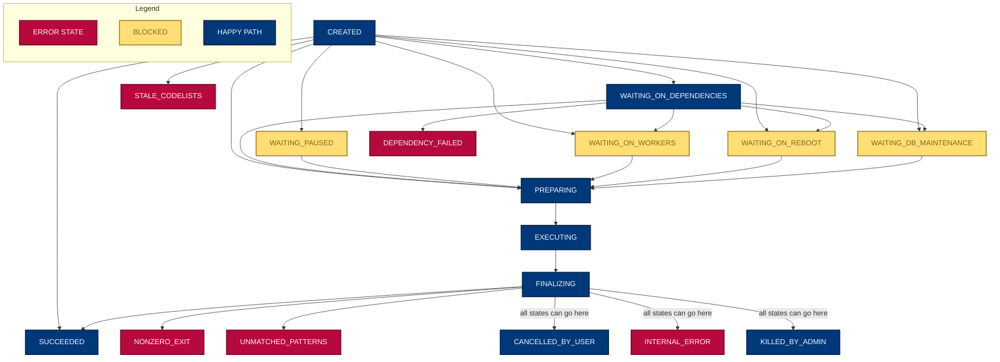

# Developer notes


## Prerequisites for local development

### Just

We use [`just`](https://github.com/casey/just) as our command runner. It's
a single file binary available for many platforms so should be easy to
install.

```sh
# macOS
brew install just

# Linux
# Install from https://github.com/casey/just/releases

# Add completion for your shell. E.g. for bash:
source <(just --completions bash)

# Show all available commands
just #  shortcut for just --list
```

### Python

You'll need an appropriate version of Python on your PATH. Check the
`.python-version` file for the required version.

### Docker

You will also need an up-to-date version of Docker Compose. Instructions to install it are [here](https://docs.docker.com/compose/install/).


## Getting started

Set up a local development environment with:
```
just devenv
```

This includes the production dependencies in `requirements.txt` (which
are intentionally kept minimal) and the dev dependencies in `requirements.dev.txt`.

It also creates a `.env` file from `dotenv-sample`, and populates the
`HIGH_PRIVACY_STORAGE_BASE` and `MEDIUM_PRIVACY_STORAGE_BASE` environment
variables.

Update `.env` to add a value for `PRIVATE_REPO_ACCESS_TOKEN`; this should be a
developer [GitHub PAT](https://docs.github.com/en/authentication/keeping-your-account-and-data-secure/managing-your-personal-access-tokens#about-personal-access-tokens) with `repo` scope.


## Architecture

The package has two main entrypoints:
[jobrunner.sync](./jobrunner/sync.py) and
[jobrunner.run](./jobrunner/run.py). Both are implemented as infinite
loops with a fixed sleep period and are designed to be run as services.

### jobrunner.sync

This handles all communication between the job-server and the
job-runner. It polls the job-server for active JobRequests, updates its
local Jobs table accordingly, and then posts back the details of all
Jobs associated with the active JobRequests it received.

The bulk of the work here is done by the
[create_or_update_jobs](./jobrunner/create_or_update_jobs.py) module.

### jobrunner.run

This runs Docker containers based on the contents of the Jobs table.
It's implemented as a synchronous loop which polls the database for
active jobs and takes appropriate actions.

The bulk of the work here is done by the the [local Docker executor
implementation](./jobrunner/executors/local.py) module which starts new Docker
containers and stores the appropriate outputs when they finish.

### Job State

Jobs move through a defined set of `StatusCode`'s as the job-runner manages them.
These are defined in `jobrunner/models.py`.

The diagram below shows the transitions, but all states have an implicit transition to
`INTERNAL_ERROR` or `CANCELLED_BY_USER`, which is not shown.




## Testing


Tests can be run with:

    just test

Some of these tests involve talking to GitHub and there is a big fat
integration test which takes a while to run. You can run just the fast
tests with:

    just test-fast

The big integration test will sit there inscrutably for 30s-1min.
If you want to know what it's up to you can get pytest to show the log output with:

    just test-verbose

### Testing in docker

To run tests in docker, simply run:

    just docker/test

This will build the docker image and run tests. You can run job-runner as
a service with:

    just docker/service

Or run a command inside the docker image:

    just docker/run ARGS=command  # bash by default


## Running jobs locally

Adding jobs locally is most easily done with the `just add-job` command, which
calls `jobrunner.cli.add_job` with a study repo and an action to run e.g.
```
just add-job https://github.com/opensafely/os-demo-research run_all
```

As well as URLs this will accept paths to local git repos e.g.
```
just add-job ../os-demo-research run_all
```

You can now run the main loop and you'll see it pick up the jobs:
```
just run
```

See the full set of options `add-job` will accept with:
```
python -m jobrunner.cli.add_job --help
```

## job-runner docker image

Building the dev docker image:

    make -C docker-build                   # build base and dev image
    make -C docker-build ENV=prod          # build base and prod image
    make -C docker-build ARGS=--no-cache   # build without cache


### Exposing the host's docker service

By default, running the docker container will mount your host's
`/var/run/docker.sock` into the container and use that for job-runner to run
jobs. It does some matching of docker GIDs to do so.

However, it also supports accessing docker over ssh:

    make -C docker enable-docker-over-ssh

The docker-compose invocations will now talk to your host docker over SSH,
possibly on a remote machine. You can disable with:

    make -C docker disable-docker-over-ssh

Note: The above commands will automatically generate a local ed25519
dev ssh key, and add it to your `~/.ssh/authorized_keys` file. You can use
`just docker-clean` to remove this.  If you wish to use a different user/host,
you can do so:

1. Specify `SSH_USER` and `SSH_HOST` environment variables.
2. Add an authorized ed25519 private key for that user to `docker/ssh/id_ed25519`.
3. Run `touch docker/ssh/id_ed25519.authorized` to let Make know that it is all
   set up.


## Database schema and migrations

jobrunner uses a minimal ORM-lite wrapper to talk to the DB.

The current version of a tables schema definition is stored in the the
`__tableschema__` attribute for that model's class, i.e. `Job.__tableschema__`.
This is use to create the table in dev and test, so migrations are not usually
needed in those cases.

### Adding a migration

However, we also occasionally need to apply changes to this schema in
production, or in a user's local opensafely-cli database.

To do this, we track migrations in `jobrunner/models.py`. Add a migration like so:

```python
database.migration(1, """
DDL STATEMENT 1;
DDL STATEMENT 2;
""")
```

These statements are run together in a single transaction, along with
incrementing the `user_version` in the database.

Note: be aware that there are various restrictions on ALTER TABLE statements in
sqlite:

https://www.sqlite.org/lang_altertable.html#alter_table_add_column


### Applying migrations


Trying to run jobrunner as a service will error if the database does not exist
or is out of date, as a protection against misconfiguration.

To initialise or migrate the database, you can use the migrate command:

```sh
python -m jobrunner.cli.migrate
```


## Deploying
jobrunner is currently deployed by hand because of the difficulties of adding automated deploys to backend servers.

Connect to the relevant backend server:

### TPP
1. Log onto the VPN
1. RDP onto L3
1. SSH into the linux VM running on L3
1. Switch to the [jobrunner user](https://github.com/opensafely-core/backend-server/blob/main/playbook.md#jobrunner-user)


### EMIS
1. SSH into EMIS


When you're connected to the relevant server:
1. [Switch to the jobrunner user](https://github.com/opensafely-core/backend-server/blob/main/playbook.md#jobrunner-user)
1. Change to the `/srv/backend-server` directory
1. [Deploy job-runner](https://github.com/opensafely-core/backend-server/blob/main/playbook.md#deploy-job-runner)
  1. Note the sections on dependencies and config, if those are relevant to your deploy
1. [Watch the logs for errors](https://github.com/opensafely-core/backend-server/blob/main/playbook.md#viewing-job-runner-logs)
