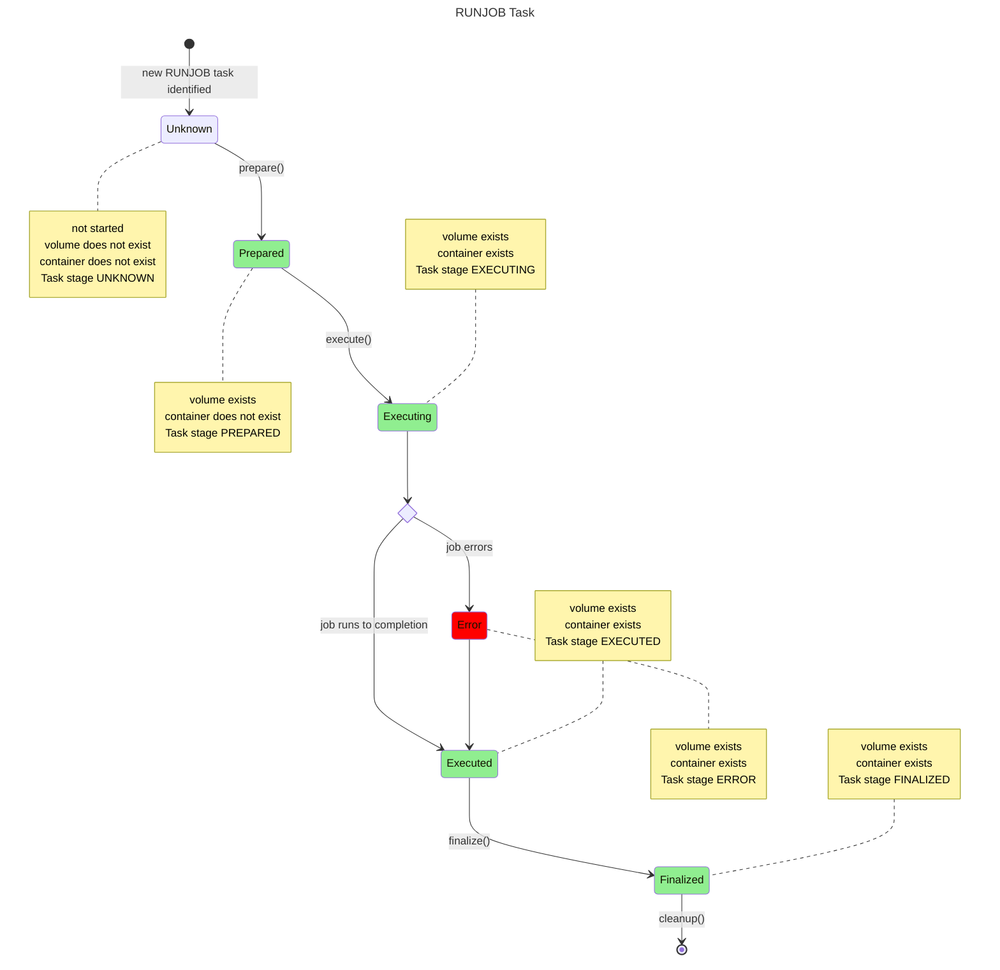
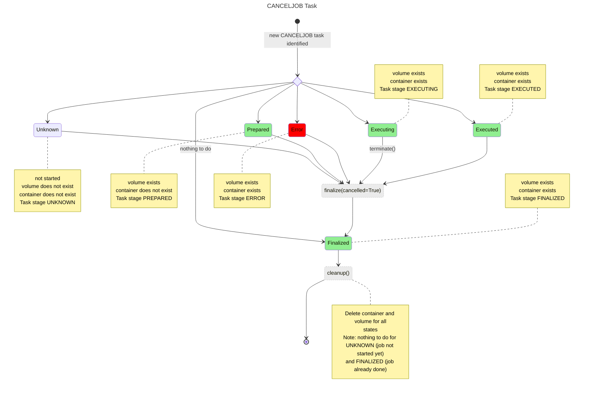

# Agent state diagram

This state diagram describes the state changes of Tasks from the
perspective of the Agent.

Note that the Agent is only concerned with executing Tasks. At each stage, task state is sent back to the controller so that the
Controller can update Job state.

The process differs depending on the type of task. The diagrams below show the flow for the two job-related tasks: `RUNJOB` and `CANCELJOB`.

The flow for a CANCELJOB task depends on the initial state of docker containers and volumes associated with the job to be cancelled.

