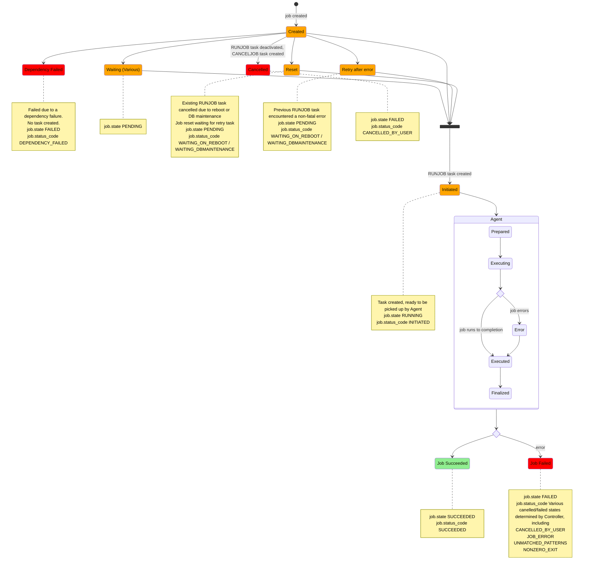

# Controller state diagram

This state diagram describes the state changes of Jobs from the
perspective of the Controller.

States in orange are pending (i.e. prior to a task being picked
up by the Agent). States in red are final failed states, and those in green are final success states.

Note that during the Agent-handled stages, task state is posted back to the controller in order to update Job state. The Agent does not itself update Job state.

