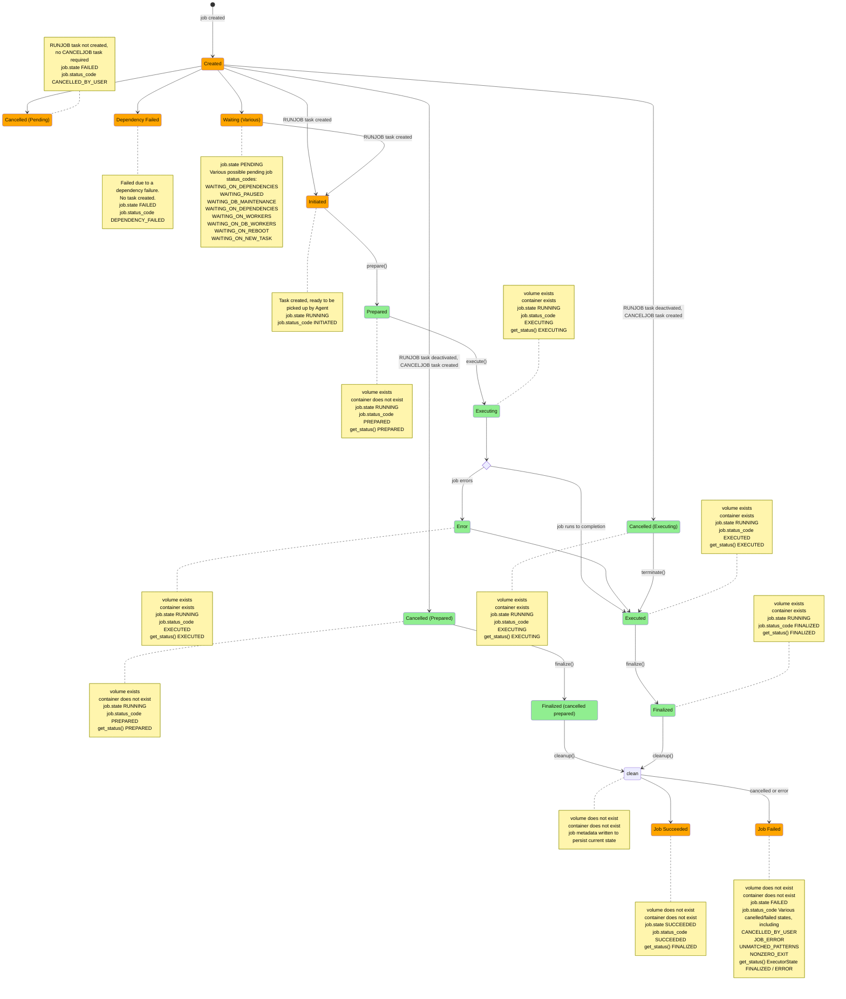

# Job execution state diagram

This state diagram describes the amalgamation of `controller/main.py`, `agent/main.py` and `local_executor.py` to facilitate understanding changes that cut across both of them.

States in orange are handled by the Controller, and those in green are handled by the Agent and executor.

Note that during Agent-handled stages, task state is posted back to the controller in order to update Job state. The Agent does not itself update Job state.

