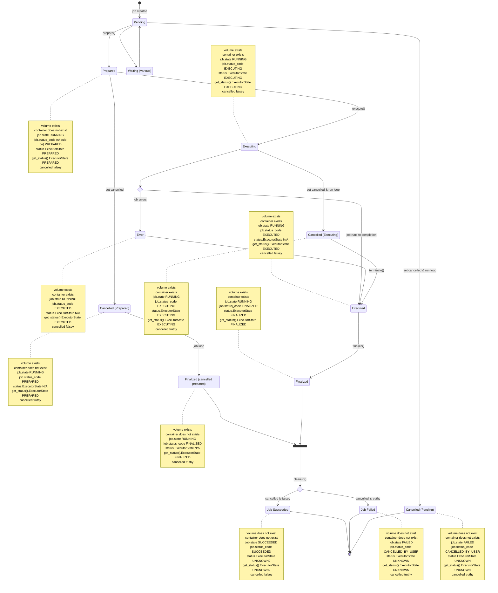

# Local Executor state diagram

This state diagram describes the amalgamation of `local_executor.py` and `run.py` to facilitate understanding changes that cut across both of them, this was really useful for @madwort when working on the intricacies of cancellation. Details should be verified with the current version of the code, and also cross-referenced with StubExecutor & the pytests.

